# AI Agent 学习知识图谱

> 🧠 这是一个基于 Obsidian 的知识管理系统，包含完整的学习路径和双链链接

---

## 🗺️ 学习路径概览

```
入门 → 基础 → 进阶 → 实战 → 部署
```

### 学习阶段

| 阶段 | 教程 | 对应项目 |
|------|------|----------|
| 入门 | [[00-LangChain入门教程]] | `projects/00-python-fundamentals/` |
| 基础 | [[01-基础入门教程]] | `projects/01-langchain-basics/` |
| 对话 | [[02-聊天机器人教程]] | `projects/02-langchain-chatbot/` |
| 工具 | [[03-工具调用教程]] | `projects/03-langchain-tools/` |
| RAG | [[04-RAG教程]] | `projects/04-langchain-rag/` |
| Agent | [[05-Agent教程]] | `projects/05-langchain-agents/` |
| Prompt | [[06-Prompt工程教程]] | `projects/06-prompt-engineering/` |
| 高级RAG | [[07-高级RAG教程]] | `projects/07-advanced-rag/` |
| Agent架构 | [[08-Agent架构教程]] | `projects/08-agent-architecture/` |
| 多Agent | [[09-多Agent系统教程]] | `projects/09-multi-agent/` |
| 生产级 | [[10-生产级开发教程]] | `projects/10-production-grade/` |
| 部署 | [[11-部署教程]] | `projects/11-deployment/` |
| 运维 | [[12-运维监控教程]] | `projects/12-operations/` |

---

## 🔗 核心概念链接

### 基础概念
- [[LangChain家族包详解]] - LangChain 各包的作用
- [[环境变量配置指南]] - .env 文件配置方法
- [[Agent API迁移指南]] - API 版本变化说明

### 核心技术
- **RAG 系统**: [[04-RAG教程]] → [[07-高级RAG教程]] → [[02-RAG系统优化]]
- **Agent 开发**: [[05-Agent教程]] → [[08-Agent架构教程]] → [[09-多Agent系统教程]]
- **工具调用**: [[03-工具调用教程]] → [[03-Agent设计原则]]

### 最佳实践
- [[01-Prompt设计模式]] - Prompt 工程技巧
- [[02-RAG系统优化]] - RAG 优化策略
- [[03-Agent设计原则]] - Agent 设计最佳实践
- [[04-生产环境检查清单]] - 生产部署检查
- [[05-性能优化指南]] - 性能调优
- [[06-成本控制策略]] - 成本管理

---

## 📚 文档分类导航

### 学习笔记
- [[入门指南]] - 学习入门
- [[Python异步编程在AI中的应用]] - Python 基础
- [[环境变量配置指南]] - 环境配置
- [[环境变量指南]] - 环境变量配置说明

### 教程系列
- [[00-LangChain入门教程]] - 快速入门
- [[01-基础入门教程]] - LLM 调用基础
- [[02-聊天机器人教程]] - 对话系统
- [[03-工具调用教程]] - 工具集成
- [[04-RAG教程]] - 检索增强生成
- [[05-Agent教程]] - 智能代理
- [[06-Prompt工程教程]] - 提示词工程
- [[07-高级RAG教程]] - 高级检索
- [[08-Agent架构教程]] - Agent 架构
- [[09-多Agent系统教程]] - 多Agent协作
- [[10-生产级开发教程]] - 生产级实践
- [[11-部署教程]] - 部署方案
- [[12-运维监控教程]] - 运维监控

### 速查表
- [[LangChain速查表]] - 快速参考

### 学习规划
- [[项目实战与简历指南]] - 项目实战与简历指导

### 案例研究
- [[01-智能客服系统案例]] - 客服场景
- [[02-代码助手案例]] - 编程辅助
- [[03-数据分析Agent案例]] - 数据分析
- [[04-文档问答系统案例]] - 文档问答

### 资源链接
- [[学习资源链接]] - 外部学习资源

---

## 🎯 学习路线图

### 第一阶段：基础入门（1-2周）
1. [[00-LangChain入门教程]] - 了解整体架构
2. [[01-基础入门教程]] - LLM 调用基础
3. [[环境变量配置指南]] - 环境配置

### 第二阶段：核心能力（2-3周）
1. [[02-聊天机器人教程]] - 对话历史管理
2. [[03-工具调用教程]] - 工具集成
3. [[04-RAG教程]] - 文档检索

### 第三阶段：高级进阶（2-3周）
1. [[05-Agent教程]] - 智能代理
2. [[06-Prompt工程教程]] - 提示词优化
3. [[07-高级RAG教程]] - 高级检索策略

### 第四阶段：架构设计（2周）
1. [[08-Agent架构教程]] - Agent 架构
2. [[09-多Agent系统教程]] - 多Agent协作

### 第五阶段：生产部署（2周）
1. [[10-生产级开发教程]] - 生产级实践
2. [[11-部署教程]] - 部署方案
3. [[12-运维监控教程]] - 运维监控

---

## 🔄 双链关系图

```mermaid
graph TD
    A[知识图谱] --> B[00-LangChain入门教程]
    B --> C[01-基础入门教程]
    B --> D[LangChain家族包详解]
    B --> E[环境变量配置指南]
    
    C --> F[02-聊天机器人教程]
    C --> G[03-工具调用教程]
    
    F --> H[05-Agent教程]
    G --> H
    
    H --> I[08-Agent架构教程]
    H --> J[09-多Agent系统教程]
    
    G --> K[04-RAG教程]
    K --> L[07-高级RAG教程]
    
    K --> M[01-Prompt设计模式]
    L --> N[02-RAG系统优化]
    
    I --> O[03-Agent设计原则]
    
    O --> P[10-生产级开发教程]
    P --> Q[11-部署教程]
    Q --> R[12-运维监控教程]
```



---

## 📖 快速导航

| 类型 | 文档 |
|------|------|
| 入门 | [[00-LangChain入门教程]] |
| 基础 | [[01-基础入门教程]] |
| RAG | [[04-RAG教程]] |
| Agent | [[05-Agent教程]] |
| 速查 | [[LangChain速查表]] |
| 最佳实践 | [[01-Prompt设计模式]] |

---

**最后更新**: 2026年6月

---

> 💡 **提示**：点击任意链接即可跳转，Obsidian 会自动建立反向链接
